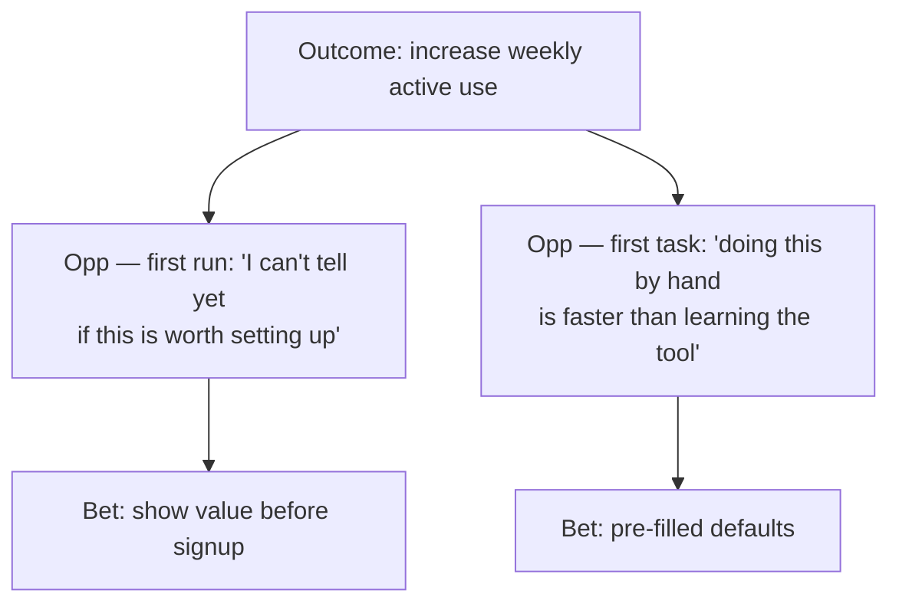

AI Skills Pack

 

# Design beyond the surface.

 

Whether you're directing your AI or working alongside it, Layers
 walks you both through all seven layers of product design — so the
 decisions underneath the screen actually get made.

 
 
 

Install in Claude Code, Cursor, Codex & more

 
 
npx skills add jamiemill/layers-skills
 
 
Copy
 
Copied
 
 
 

Install once with the skills package, then run any/layers-*skill
 in your AI tool.

 
 
 
 
Works with
 
* Claude Code
* Cursor
* OpenAI Codex
* pi.dev
* + 50 more
 
 

Open source · github.com/jamiemill/layers-skills

 
 
 
 
 
 
 
 
 
 
 
 
 07 
 
Surface
 

→

 
 
 06 
 
Interaction structure & flow
 

→

 
 
 05 
 
Conceptual model
 

→

 
 
 04 
 
Product & service strategy
 

→

 
 
 
 03 
 
User needs
 

→

 
 
 02 
 
The domain
 

→

 
 
 01 
 
Observed behaviour
 

→

 
 
 
Reality
 
 
 

Not sure where to start?Run /layers-orient— it audits
 all seven layers and tells you which one is your bottleneck.

 

Browse all 9 skills →

 
 
 
 
 
 

### Start broad

 

When you don't yet know which layer the problem lives at.

 
* I've been asked to redesign onboarding — use theLayersskills to help me think it through properly.
* Help me figure out why my team can't agree on how to design this feature. UseLayersto surface what we're actually disagreeing about.
* I'm stuck on this design and I don't know what's wrong. UseLayersto diagnose where the real problem is.
* Audit my mockups with theLayersskills — what decisions am I assuming, and which ones haven't actually been made?
 
 
 

### Or go straight to a layer

 

When you know which decisions you need to make.

 
* I've got 12 user interviews. Run/layers-user-needsand turn them into prioritised job stories.
* Help me model the objects, relationships, and vocabulary for this scheduling tool with/layers-conceptual-model.
* Run/layers-interaction-flowfor this checkout — surface the edge cases and empty states I'm missing.
* My team can't agree on terminology across product, design, and engineering. Use/layers-domainto map the conflicts.
 
 
 
 
 
 
 
 

What you get back

 

## Decisions, not screens.

 

Skills capture design decisions as markdown and mermaid — job
 stories, strategy trees, object maps, breadboards, decision
 inventories. Plain text, readable by humans, by AI, and by every
 other tool you use.

 

Need decisions to live in Linear, Notion, Figma, or GitHub instead?
 Connect an MCP and the skill writes there directly.

 
 
 
 
 
Example artifact

Output from 
/layers-product-strategy
 
 
 
 
 
Preview
 
Markdown
 
 
 

### Strategy tree

 
graph TD
 O["Outcome: increase weekly active use"]
 O --> Op1["Opp — first run: 'I can't tell yet if this is worth setting up'"]
 O --> Op2["Opp — first task: 'doing this by hand is faster than learning the tool'"]
 Op1 --> B1["Bet: show value before signup"]
 Op2 --> B2["Bet: pre-filled defaults"]
 

Prioritised bet:show value before signup.

 
* Risk:cold visitors may not engage enough to surface real
 value.
* Validation:cohort A/B on signup conversion + qualitative
 session review.
* Linked needs:#user-needs/onboarding-momentum
 
 
 
## Strategy tree

**Prioritised bet:** show value before signup.

- *Risk:* cold visitors may not engage enough to surface real value.
- *Validation:* cohort A/B on signup conversion + qualitative session review.
- *Linked needs:* `#user-needs/onboarding-momentum`

 
 
 
 
 
 
 
 
 

About

 

## The Layers framework, made available to AI.

 

Layers is a model of product design as seven layers across three zones.
 The framework is byJamie Mill; the skills make it
 executable inside the AI tools you already use.

 

More about the framework →